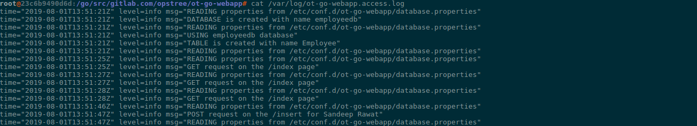
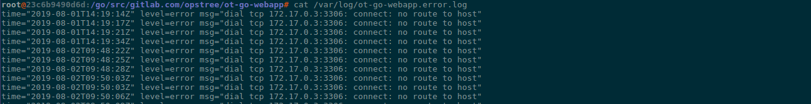
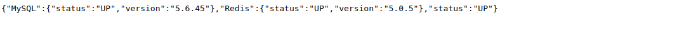

# Contributing
Thanks for your interest in helping to grow this repository, and make it better for developers everywhere! This document serves as a guide to help you quickly gain familarity with the repository, and start your development environment so that you can quickly hit the ground running.

## Layout

```s
ot-go-webapp
├── Dockerfile       ---> Dockerfile to dockerize the complete application
├── Gopkg.lock       ---> Automated generated file by dep dependency manager
├── Gopkg.toml       ---> Automated generated file by dep dependency manager
├── main.go          ---> Main function file to call all the function
├── main_test.go     ---> Test case for main function calling
├── README.md        ---> The file which you are going through right now
└── webapp           ---> Actual codebase for webapp folder
    ├── main.go      ---> Main file for calling webapps functions
    ├── main_test.go ---> Main webapp test cases file
    ├── sql.go       ---> This file holds all the sql functionalities related stuff
    ├── sql_test.go  ---> Test cases file for sql functionalities
    └── template.go  ---> This file has the HTML template for Web Interface
```

## Application Overview
OT Go-App is a CRUD application which provides a Web UI Interface for Employee Management. As a functionality wise it provides:- 

- Web UI interface for employee management
- It stores all the data in MySQL database
- It provides functionality of auto-reconnection of database
- Generates log file for access log and error in */var/log*
    - Access logs will lies in `/var/log/ot-go-webapp.access.log`

    - Error logs will lies in `/var/log/ot-go-webapp.error.log`

- We can pass the database credentials via properties file or environment variables
- For properties file we have to store `database.properties` at this location `/etc/conf.d/ot-go-webapp/database.properties` and the content should be something like this :-

```properties
DB_USER = root
DB_PASSWORD = password
DB_URL = 172.17.0.3
DB_PORT = 3306
```

- For environment variables we have to set these environment variables
    - **DB_USER** ---> Name of the database user
    - **DB_PASSWORD** ---> Password of the database user
    - **DB_URL** ---> URL of the database server
    - **DB_PORT** ---> Port on which database is running

- There is health check url also available at /health, which provides the information that application is healthy or not



**Important:- In MySQL database should exist with name employeedb**

## Building your environment

For building the environment you can go through this main README file:-

https://gitlab.com/opstree/ot-go-webapp#building-application


## Raising Merge Request

Merge request should have proper title.

For example:-

```
[BRANCH_NAME][TYPE_OF_CHANGE] ### Comment


[Release-1.0][Add] Added css for better visualization
```

#### TYPE OF CHANGE

|Change|Description|
|------|-------|
|**Add**| While adding something new|
|**Remove**|While removing something|
|**BugFix**|For fixing any bugs|
|**Change**|If you are changing something|
|**Update**|If there is new update in any package or plugin|
