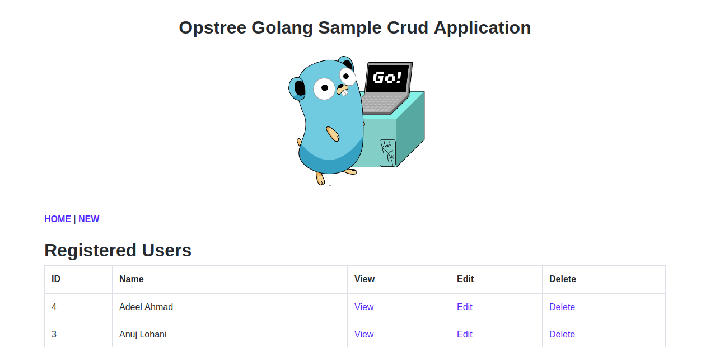

# Opstree-Go-WebApp

The main goal of creating this sample Golang application is to provide an environment and idea of Golang Application's **build**, **test** and **deploy** phase.

**The application looks likes this:-**



## Requirments

- **[Golang](https://golang.org/)** ---> For development environment
- **[Docker](https://www.docker.com/)** ---> For dockerizing the application
- **[Dep](https://github.com/golang/dep)** ---> For Golang dependency management

## Overview

OT Go-App is a CRUD application which provides a Web UI Interface for Employee Management. As a functionality wise it provides:- 

- Web UI interface for employee management
- It stores all the data in MySQL database
- It provides functionality of auto-reconnection of database
- Generates log file for access log and error in */var/log*
    - Access logs will lies in `/var/log/ot-go-webapp.access.log`

    - Error logs will lies in `/var/log/ot-go-webapp.error.log`

- We can pass the database credentials via properties file or environment variables
- For properties file we have to store `database.properties` at this location `/etc/conf.d/ot-go-webapp/application.ini` and the content should be something like this :-

```ini
[database]
ENABLED     = true
DB_URL      = 172.17.0.3
DB_PORT     = 3306
DB_USER     = root
DB_PASSWORD = password

[redis]
ENABLED    = true
REDIS_HOST = 172.17.0.4
REDIS_PORT = 6379
```

- For environment variables we have to set these environment variables
    - **DB_USER** ---> Name of the database user
    - **DB_PASSWORD** ---> Password of the database user
    - **DB_URL** ---> URL of the database server
    - **DB_PORT** ---> Port on which database is running
    - **ENABLED** ---> Enable redis for caching or not
    - **REDIS_HOST** ---> URL of the redis server
    - **REDIS_PORT** ---> PORT of the redis server

- There is health check url also available at /health, which provides the information that application is healthy or not


**Important:- In MySQL database should exist with name employeedb**

## Directory Layout

The folder structure of the codebase looks like this:-

```s
ot-go-webapp
├── Dockerfile       ---> Dockerfile to dockerize the complete application
├── Gopkg.lock       ---> Automated generated file by dep dependency manager
├── Gopkg.toml       ---> Automated generated file by dep dependency manager
├── main.go          ---> Main function file to call all the function
├── main_test.go     ---> Test case for main function calling
├── README.md        ---> The file which you are going through right now
└── webapp           ---> Actual codebase for webapp folder
    ├── main.go      ---> Main file for calling webapps functions
    ├── main_test.go ---> Main webapp test cases file
    ├── sql.go       ---> This file holds all the sql functionalities related stuff
    ├── sql_test.go  ---> Test cases file for sql functionalities
    └── template.go  ---> This file has the HTML template for Web Interface
```

## Building Application

#### For non-dockerized environment

This webapp is written in go so it builds the application in the form of binary. For downloading the dependency through dep:-

```shell
dep ensure
```

If you are not using the dep use go for downloading the dependency but there is a fallback in this, you will not get the exact version :stuck_out_tongue_winking_eye:

```shell
go get -u ./...
```

After downloading the dependency only thing left is building it, for which we can use simple golang command line

```shell
go build
```

#### For dockerized environment

For dockerized environment just run:-

```shell
docker build -t opstreedevops/ot-go-webapp:latest -f Dockerfile .
```

## Running Application

#### For non-dockerized environment

First we have to create a database in MySQL

```sql
CREATE DATABASE IF NOT EXISTS employeedb;
```

Once the database is created, create a properties file or set environment as given above and then execute the binary

```shell
./ot-go-webapp
```

Now you will be able to access the app at http://<your_server_ip>:8080/ and health url at http://<your_server_ip>:8080/health

#### For dockerized environment

First we have to run the mysql container

```shell
docker run -itd --name mysql -e MYSQL_ROOT_PASSWORD=password -e MYSQL_DATABASE=employeedb mysql:5.6
```

Once the mysql container is created, we have to start the application

```shell
docker run -itd --name application --link mysql:mysql -e DB_USER=root -e DB_PASSWORD=password -e DB_URL=mysql -e DB_PORT=3306 opstreedevops/ot-go-webapp:latest
```

## To Do
- [X] Implement logging
- [X] Add more fields for employee
- [X] Write unit tests
- [X] Fix code if there is any mess
- [X] Integrate dependency management
- [ ] Fill README with more information
- [X] Make application more attractive
- [X] Add healthcheck API
- [X] Logging of acccess and error log
- [ ] Provide file uploading functionality
- [ ] Integrate redis for caching purpose
- [ ] Dump manifests file for kubernetes deployment
- [X] Replace property file from ini structure file
- [ ] Structure code in better manner(Refactoring)
- [ ] Implement json logging
- [ ] Add docker compose setup
